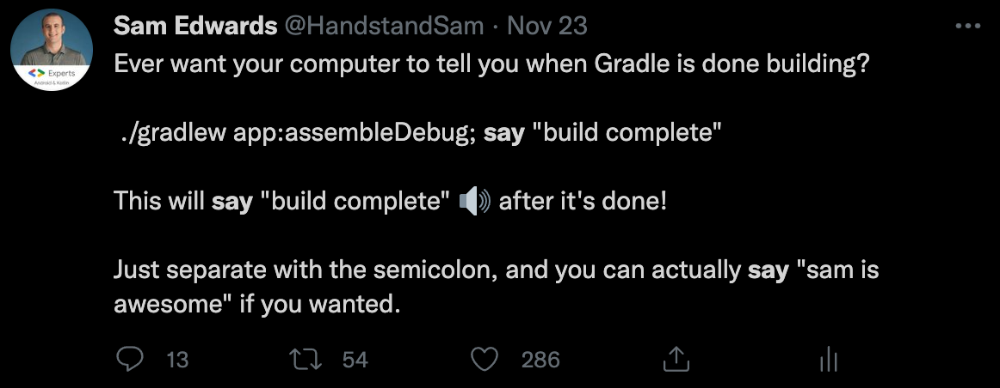

# Saydle - "Say Gradle"
Saydle is a Wrapper for the Gradle Wrapper that notifies you via the OSX [`say`](https://ss64.com/osx/say.html) command whether a task failed or succeded.

# Why?
Knowing when a Gradle build is done is super helpful when there are long running tasks.  This allows you to be notified instead of checking the terminal.

[](https://twitter.com/HandstandSam/status/1463207029007339520)

# System Requirements
* You must be Running Mac OSX

# Installation Instructions
* Download the [`saydlew`](https://github.com/handstandsam/saydle/blob/main/saydlew) file and put it next to your `gradlew` file in the root of your Gradle project.

# Usage
* Instead of using `./gradlew`, use `./saydlew` instead.  That's it!
* Example: `./saydlew app:assembleDebug`

# Configuration
* success_phrase="Success"
* failed_phrase="Failed"
* voice="Alex"

## Aternate Voices for the "say" Command
[OSX Say Command Documentation](https://ss64.com/osx/say.html)

**Available English Speaking Voices**
```
Alex                en_US    # Most people recognize me by my voice.
Fred                en_US    # I sure like being inside this fancy computer
Samantha            en_US    # Hello, my name is Samantha. I am an American-English voice.
Victoria            en_US    # Isn't it nice to have a computer that will talk to you?
```

**Other Languages**
Find other voices by running: `say -v '?'`